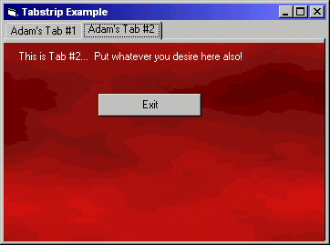



## Using TabStrips

### Description

This isnt the best example for using a tabstrip...

but i felt i needed to submit something... i hope it helps someone out...

email me with comments...

and as always... VOTE!!!
 
### More Info
 

             |
---                |---
**Submitted On**   |2000-05-29 02:29:38
**By**             |[AdamSpicer](https://github.com/Planet-Source-Code/PSCIndex/blob/master/ByAuthor/adamspicer.md)
**Level**          |Beginner
**User Rating**    |4.3 (34 globes from 8 users)
**Compatibility**  |VB 5\.0, VB 6\.0
**Category**       |[Custom Controls/ Forms/  Menus](https://github.com/Planet-Source-Code/PSCIndex/blob/master/ByCategory/custom-controls-forms-menus__1-4.md)
**World**          |[Visual Basic](https://github.com/Planet-Source-Code/PSCIndex/blob/master/ByWorld/visual-basic.md)
**Archive File**   |[CODE\_UPLOAD62035292000\.zip](https://github.com/Planet-Source-Code/adamspicer-using-tabstrips__1-8437/archive/master.zip)

